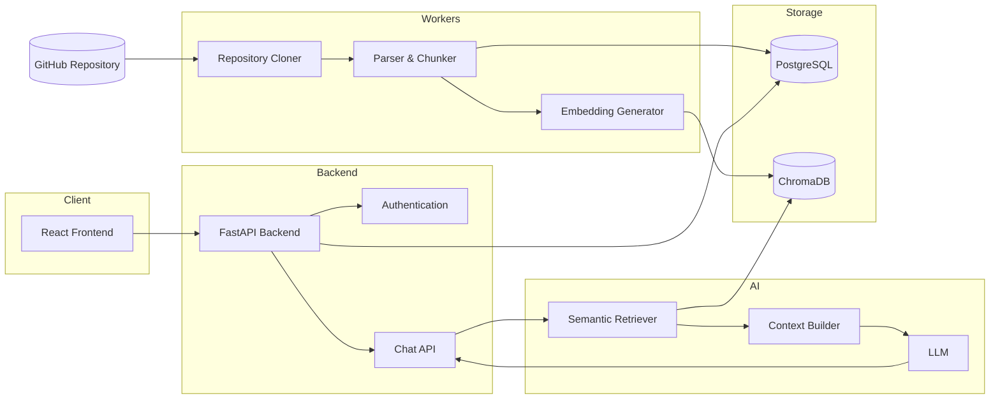
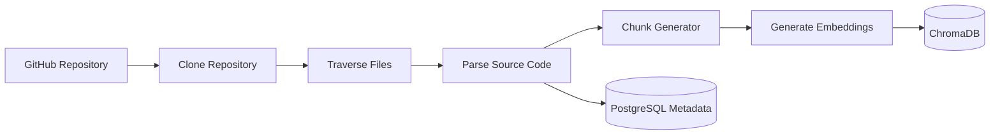
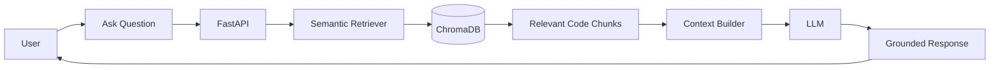
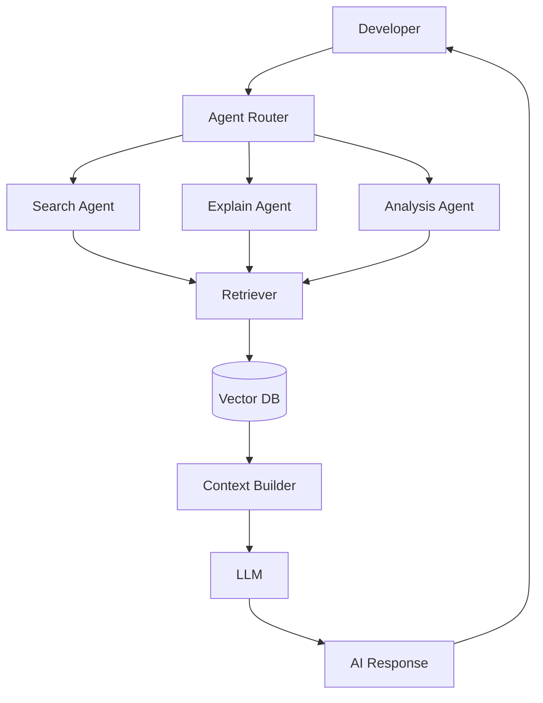
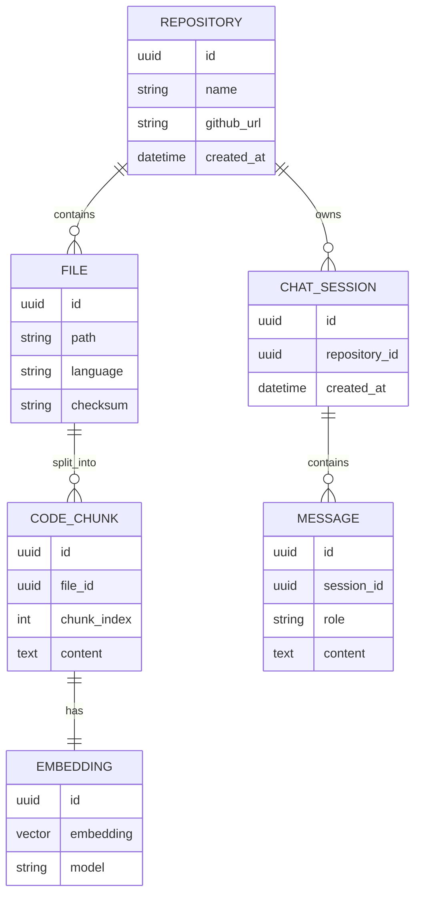
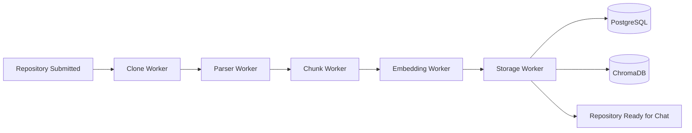
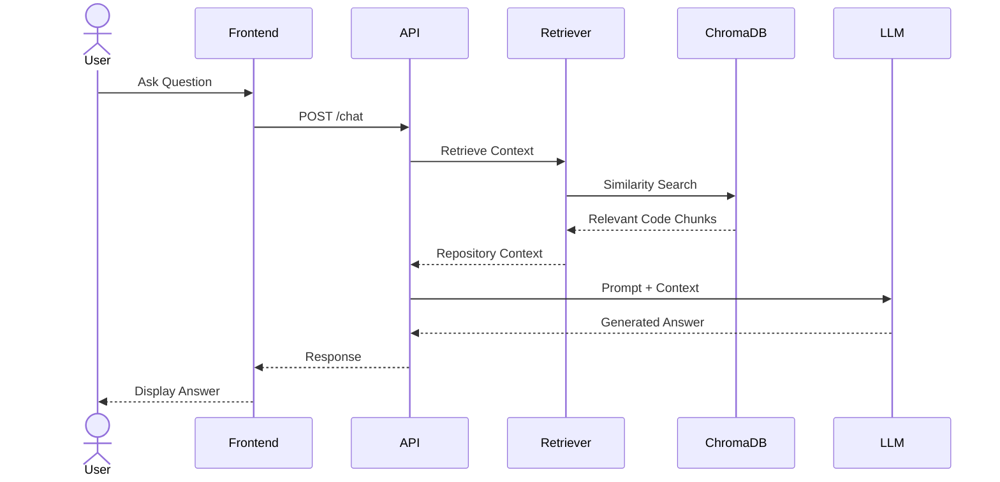

# Architecture Diagrams

---

# 1. Overall System Architecture

---

# 2. Repository Indexing Pipeline

---

# 3. RAG Flow

---

# 4. Agent Interaction Diagram

---

# 5. Database ER Diagram

---

# 6. Worker Processing Pipeline

---

# 7. System Sequence Diagram

